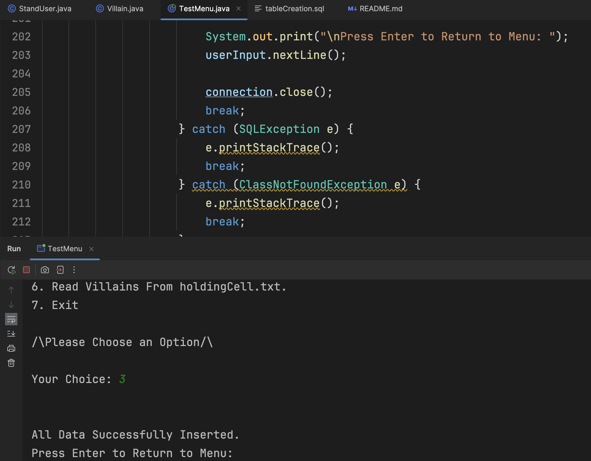

## Joey's Java QAP 4 README
<i>Created By: Joey Thomas</i> 
<i>Due Date: July 25, 2025</i>

<ol>
<li>

<b>How many hours did it take you to complete this assessment?</b>
  
It took roughly an hour to create the two classes. Along with about another hour to get the menu together. Then assembling the options of the menu, connecting to the database, and writing/reading from a text file took about two or three hours.

</li>
  
<li>

<b>What online resources did you use?</b>
  
I used the <b>JDBC</b> Documentation for learning more about how that system works and Stack Overflow for some specific curiosities I had.

</li>
  
<li>

<b>Did you get any help from your classmates?</b>
  
No, I did not end up asking my colleagues anything for this assignment. 

</li>
  
<li>

<b>Did you ask for help from an instructor?</b>
  
No, I did not end up asking my instructors anything for this assignment.

</li>
  
<li>

<b>Rate the difficulty of each problem and your confidence in solving similar problems in the future.</b>
  
On my favoured 1-10 scale, creating the two classes was 2/10, the menu was 2/10, dealing with the <b>JDBC</b> was a 3/10, and reading/writing objects to a file was 3/10.

</li>
</ol>

### Project Summary

This project demonstrates two popular ways in which data can be stored (persisted) in the Java language. Those being file reading/writing and saving to a database via the <b>JDBC</b> postgres driver. The subject of persistence in this project are two entity classes I created, <i>StandUser</i> and <i>Villain</i>. Each "Villain" is a StandUser but not every StandUser is a villain.

### How it Went for Me

This project was pretty straightforward for me, any difficulties I ran into I was able to overcome fairly quickly.

### Screenshots of the Running Code

##### Menu

##### Menu Option 1

##### Menu Option 2

##### Menu Option 3

##### Menu Option 4

##### Menu Option 5

##### Menu Option 6

##### Menu Option 7
